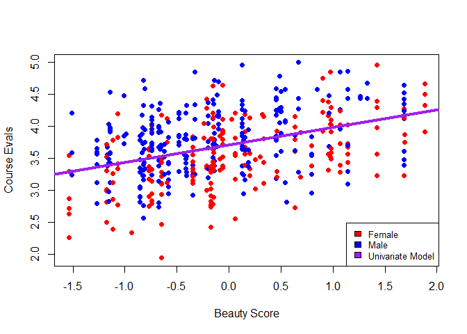
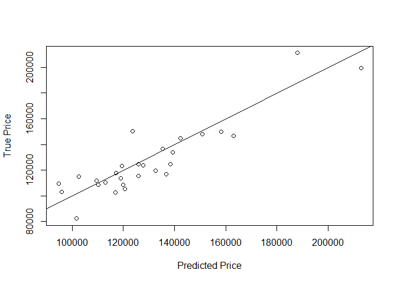

BOOK PROBLEMS
-------------

#### Chapter 2, Question 10

#### Part A

**How many rows are in this data set? How many columns? What do the rows
and columns represent?**

*Description*

The Boston dataset has 506 rows and 14 columns. Each row represents a
suburb that was sampled, and the 14 columns describe certain
characteristics of that suburb including the crime rate, average number
of rooms per house, and median value of the homes. The pairs plot below
shows graphs of all 1-to-1 varaible relationships. Several of the
variables seem to be correlated, which is expected because neighborhoods
near the city center typicaly all share some economic and demographic
characteristics.

##### Part B

**Make some pairwise scatterplots of the predictors (columns) in this
data set. Describe your findings.**

Plotting crime rates vs. median home value shows that most suburbs
sampled have a crime rate at or near zero, but there is still a loose
negative relationship between crime and median home value, which makes
intuitive sense. What is unusual is the group of positive crime rates in
the suburbs with the highest median home values. This could be because
those houses are in/near downtown.

Plotting the pupil-teacher ratio vs. the low economic status shows many
of the ptratio points at 21, which we can infer is the standard used in
some of the larger school districts. It also makes sense that wealthier
communities (lower lstat) generally have a lower pupil-teacher ratio as
there are likely more and higher quality schools.

##### Part C

**Are any of the predictors associated with per capita crime rate? If
so, explain the relationship.**

*We already saw a slight negative relationship between the crime rate
and the median home value. Below are the other relationships with the
crime rate.*

*Starting from the top left*

All land sampled with lots over 25,000 sqft (which are few) have a crime
rate of zero. Most non-zero crime samples come from areas with 17%-20%
industrial land Higher nitrogen oxide concentration seems to have a
positive relationship with the crime rate, and could be directly related
to the presence industrial land. Being adjecent to the Charles River and
the average number of rooms per house show no relationship to the crime
rate.

The remaining predictors follow the notion that higher crime rates are
in lower income areas. These suburbs are on average older, closer to the
city, and have a higher percent of people with lower status.

##### Part D

**Do any of the suburbs of Boston appear to have particularly high crime
rates? Tax rates? Pupil-teacher ratios? Comment on the range of each
predictor.**

<table class="table table-striped table-hover" style="margin-left: auto; margin-right: auto;">
<thead>
<tr>
<th style="text-align:left;">
</th>
<th style="text-align:right;">
Min
</th>
<th style="text-align:right;">
1st Qu.
</th>
<th style="text-align:right;">
Median
</th>
<th style="text-align:right;">
Mean
</th>
<th style="text-align:right;">
3rd Qu.
</th>
<th style="text-align:right;">
Max
</th>
</tr>
</thead>
<tbody>
<tr>
<td style="text-align:left;">
crim
</td>
<td style="text-align:right;">
0.00632
</td>
<td style="text-align:right;">
0.082045
</td>
<td style="text-align:right;">
0.25651
</td>
<td style="text-align:right;">
3.6135236
</td>
<td style="text-align:right;">
3.677083
</td>
<td style="text-align:right;">
88.9762
</td>
</tr>
<tr>
<td style="text-align:left;">
zn
</td>
<td style="text-align:right;">
0.00000
</td>
<td style="text-align:right;">
0.000000
</td>
<td style="text-align:right;">
0.00000
</td>
<td style="text-align:right;">
11.3636364
</td>
<td style="text-align:right;">
12.500000
</td>
<td style="text-align:right;">
100.0000
</td>
</tr>
<tr>
<td style="text-align:left;">
indus
</td>
<td style="text-align:right;">
0.46000
</td>
<td style="text-align:right;">
5.190000
</td>
<td style="text-align:right;">
9.69000
</td>
<td style="text-align:right;">
11.1367787
</td>
<td style="text-align:right;">
18.100000
</td>
<td style="text-align:right;">
27.7400
</td>
</tr>
<tr>
<td style="text-align:left;">
chas
</td>
<td style="text-align:right;">
0.00000
</td>
<td style="text-align:right;">
0.000000
</td>
<td style="text-align:right;">
0.00000
</td>
<td style="text-align:right;">
0.0691700
</td>
<td style="text-align:right;">
0.000000
</td>
<td style="text-align:right;">
1.0000
</td>
</tr>
<tr>
<td style="text-align:left;">
nox
</td>
<td style="text-align:right;">
0.38500
</td>
<td style="text-align:right;">
0.449000
</td>
<td style="text-align:right;">
0.53800
</td>
<td style="text-align:right;">
0.5546951
</td>
<td style="text-align:right;">
0.624000
</td>
<td style="text-align:right;">
0.8710
</td>
</tr>
<tr>
<td style="text-align:left;">
rm
</td>
<td style="text-align:right;">
3.56100
</td>
<td style="text-align:right;">
5.885500
</td>
<td style="text-align:right;">
6.20850
</td>
<td style="text-align:right;">
6.2846344
</td>
<td style="text-align:right;">
6.623500
</td>
<td style="text-align:right;">
8.7800
</td>
</tr>
<tr>
<td style="text-align:left;">
age
</td>
<td style="text-align:right;">
2.90000
</td>
<td style="text-align:right;">
45.025000
</td>
<td style="text-align:right;">
77.50000
</td>
<td style="text-align:right;">
68.5749012
</td>
<td style="text-align:right;">
94.075000
</td>
<td style="text-align:right;">
100.0000
</td>
</tr>
<tr>
<td style="text-align:left;">
dis
</td>
<td style="text-align:right;">
1.12960
</td>
<td style="text-align:right;">
2.100175
</td>
<td style="text-align:right;">
3.20745
</td>
<td style="text-align:right;">
3.7950427
</td>
<td style="text-align:right;">
5.188425
</td>
<td style="text-align:right;">
12.1265
</td>
</tr>
<tr>
<td style="text-align:left;">
rad
</td>
<td style="text-align:right;">
1.00000
</td>
<td style="text-align:right;">
4.000000
</td>
<td style="text-align:right;">
5.00000
</td>
<td style="text-align:right;">
9.5494071
</td>
<td style="text-align:right;">
24.000000
</td>
<td style="text-align:right;">
24.0000
</td>
</tr>
<tr>
<td style="text-align:left;">
tax
</td>
<td style="text-align:right;">
187.00000
</td>
<td style="text-align:right;">
279.000000
</td>
<td style="text-align:right;">
330.00000
</td>
<td style="text-align:right;">
408.2371542
</td>
<td style="text-align:right;">
666.000000
</td>
<td style="text-align:right;">
711.0000
</td>
</tr>
<tr>
<td style="text-align:left;">
ptratio
</td>
<td style="text-align:right;">
12.60000
</td>
<td style="text-align:right;">
17.400000
</td>
<td style="text-align:right;">
19.05000
</td>
<td style="text-align:right;">
18.4555336
</td>
<td style="text-align:right;">
20.200000
</td>
<td style="text-align:right;">
22.0000
</td>
</tr>
<tr>
<td style="text-align:left;">
black
</td>
<td style="text-align:right;">
0.32000
</td>
<td style="text-align:right;">
375.377500
</td>
<td style="text-align:right;">
391.44000
</td>
<td style="text-align:right;">
356.6740316
</td>
<td style="text-align:right;">
396.225000
</td>
<td style="text-align:right;">
396.9000
</td>
</tr>
<tr>
<td style="text-align:left;">
lstat
</td>
<td style="text-align:right;">
1.73000
</td>
<td style="text-align:right;">
6.950000
</td>
<td style="text-align:right;">
11.36000
</td>
<td style="text-align:right;">
12.6530632
</td>
<td style="text-align:right;">
16.955000
</td>
<td style="text-align:right;">
37.9700
</td>
</tr>
<tr>
<td style="text-align:left;">
medv
</td>
<td style="text-align:right;">
5.00000
</td>
<td style="text-align:right;">
17.025000
</td>
<td style="text-align:right;">
21.20000
</td>
<td style="text-align:right;">
22.5328063
</td>
<td style="text-align:right;">
25.000000
</td>
<td style="text-align:right;">
50.0000
</td>
</tr>
</tbody>
</table>
##### Part E

**How many of the suburbs in this data set bound the Charles river?**

    ## [1] 35

In this data set, 35 suburbs border the Charles River.

##### Part F

**What is the median pupil-teacher ratio among the towns in this data
set?**

    ## [1] 19.05

In this data set, the median pupil-teacher ratio is 19.05

##### Part G

**Which suburb of Boston has lowest median value of owneroccupied homes?
What are the values of the other predictors for that suburb, and how do
those values compare to the overall ranges for those predictors? Comment
on your findings.**

<table class="table table-striped table-hover" style="margin-left: auto; margin-right: auto;">
<thead>
<tr>
<th style="text-align:left;">
</th>
<th style="text-align:right;">
crim
</th>
<th style="text-align:right;">
zn
</th>
<th style="text-align:right;">
indus
</th>
<th style="text-align:right;">
chas
</th>
<th style="text-align:right;">
nox
</th>
<th style="text-align:right;">
rm
</th>
<th style="text-align:right;">
age
</th>
<th style="text-align:right;">
dis
</th>
<th style="text-align:right;">
rad
</th>
<th style="text-align:right;">
tax
</th>
<th style="text-align:right;">
ptratio
</th>
<th style="text-align:right;">
black
</th>
<th style="text-align:right;">
lstat
</th>
<th style="text-align:right;">
medv
</th>
</tr>
</thead>
<tbody>
<tr>
<td style="text-align:left;">
399
</td>
<td style="text-align:right;">
38.3518
</td>
<td style="text-align:right;">
0
</td>
<td style="text-align:right;">
18.1
</td>
<td style="text-align:right;">
0
</td>
<td style="text-align:right;">
0.693
</td>
<td style="text-align:right;">
5.453
</td>
<td style="text-align:right;">
100
</td>
<td style="text-align:right;">
1.4896
</td>
<td style="text-align:right;">
24
</td>
<td style="text-align:right;">
666
</td>
<td style="text-align:right;">
20.2
</td>
<td style="text-align:right;">
396.9
</td>
<td style="text-align:right;">
30.59
</td>
<td style="text-align:right;">
5
</td>
</tr>
</tbody>
</table>
Index number 399 has the lowest median home value in this data set. This
suburb is at the maximum of the age range, and has a relatively high
rate of crime and industrial property. Distance to the city, tax rate,
and pupil-teacher ratio confirm our previous inference of the
characteristics of a low-income inner city neighborhood.

##### Part H

**In this data set, how many of the suburbs average more than seven
rooms per dwelling? More than eight rooms per dwelling? Comment on the
suburbs that average more than eight rooms per dwelling.**

    ## [1] "Number of suburbs with an average number of rooms per household above seven:"

    ## [1] 64

    ## [1] "Number of suburbs with an average number of rooms per household above eight:"

    ## [1] 13

<table class="table table-striped table-hover" style="margin-left: auto; margin-right: auto;">
<thead>
<tr>
<th style="text-align:left;">
</th>
<th style="text-align:right;">
crim
</th>
<th style="text-align:right;">
zn
</th>
<th style="text-align:right;">
indus
</th>
<th style="text-align:right;">
chas
</th>
<th style="text-align:right;">
nox
</th>
<th style="text-align:right;">
rm
</th>
<th style="text-align:right;">
age
</th>
<th style="text-align:right;">
dis
</th>
<th style="text-align:right;">
rad
</th>
<th style="text-align:right;">
tax
</th>
<th style="text-align:right;">
ptratio
</th>
<th style="text-align:right;">
black
</th>
<th style="text-align:right;">
lstat
</th>
<th style="text-align:right;">
medv
</th>
</tr>
</thead>
<tbody>
<tr>
<td style="text-align:left;">
98
</td>
<td style="text-align:right;">
0.12083
</td>
<td style="text-align:right;">
0
</td>
<td style="text-align:right;">
2.89
</td>
<td style="text-align:right;">
0
</td>
<td style="text-align:right;">
0.4450
</td>
<td style="text-align:right;">
8.069
</td>
<td style="text-align:right;">
76.0
</td>
<td style="text-align:right;">
3.4952
</td>
<td style="text-align:right;">
2
</td>
<td style="text-align:right;">
276
</td>
<td style="text-align:right;">
18.0
</td>
<td style="text-align:right;">
396.90
</td>
<td style="text-align:right;">
4.21
</td>
<td style="text-align:right;">
38.7
</td>
</tr>
<tr>
<td style="text-align:left;">
164
</td>
<td style="text-align:right;">
1.51902
</td>
<td style="text-align:right;">
0
</td>
<td style="text-align:right;">
19.58
</td>
<td style="text-align:right;">
1
</td>
<td style="text-align:right;">
0.6050
</td>
<td style="text-align:right;">
8.375
</td>
<td style="text-align:right;">
93.9
</td>
<td style="text-align:right;">
2.1620
</td>
<td style="text-align:right;">
5
</td>
<td style="text-align:right;">
403
</td>
<td style="text-align:right;">
14.7
</td>
<td style="text-align:right;">
388.45
</td>
<td style="text-align:right;">
3.32
</td>
<td style="text-align:right;">
50.0
</td>
</tr>
<tr>
<td style="text-align:left;">
205
</td>
<td style="text-align:right;">
0.02009
</td>
<td style="text-align:right;">
95
</td>
<td style="text-align:right;">
2.68
</td>
<td style="text-align:right;">
0
</td>
<td style="text-align:right;">
0.4161
</td>
<td style="text-align:right;">
8.034
</td>
<td style="text-align:right;">
31.9
</td>
<td style="text-align:right;">
5.1180
</td>
<td style="text-align:right;">
4
</td>
<td style="text-align:right;">
224
</td>
<td style="text-align:right;">
14.7
</td>
<td style="text-align:right;">
390.55
</td>
<td style="text-align:right;">
2.88
</td>
<td style="text-align:right;">
50.0
</td>
</tr>
<tr>
<td style="text-align:left;">
225
</td>
<td style="text-align:right;">
0.31533
</td>
<td style="text-align:right;">
0
</td>
<td style="text-align:right;">
6.20
</td>
<td style="text-align:right;">
0
</td>
<td style="text-align:right;">
0.5040
</td>
<td style="text-align:right;">
8.266
</td>
<td style="text-align:right;">
78.3
</td>
<td style="text-align:right;">
2.8944
</td>
<td style="text-align:right;">
8
</td>
<td style="text-align:right;">
307
</td>
<td style="text-align:right;">
17.4
</td>
<td style="text-align:right;">
385.05
</td>
<td style="text-align:right;">
4.14
</td>
<td style="text-align:right;">
44.8
</td>
</tr>
<tr>
<td style="text-align:left;">
226
</td>
<td style="text-align:right;">
0.52693
</td>
<td style="text-align:right;">
0
</td>
<td style="text-align:right;">
6.20
</td>
<td style="text-align:right;">
0
</td>
<td style="text-align:right;">
0.5040
</td>
<td style="text-align:right;">
8.725
</td>
<td style="text-align:right;">
83.0
</td>
<td style="text-align:right;">
2.8944
</td>
<td style="text-align:right;">
8
</td>
<td style="text-align:right;">
307
</td>
<td style="text-align:right;">
17.4
</td>
<td style="text-align:right;">
382.00
</td>
<td style="text-align:right;">
4.63
</td>
<td style="text-align:right;">
50.0
</td>
</tr>
<tr>
<td style="text-align:left;">
227
</td>
<td style="text-align:right;">
0.38214
</td>
<td style="text-align:right;">
0
</td>
<td style="text-align:right;">
6.20
</td>
<td style="text-align:right;">
0
</td>
<td style="text-align:right;">
0.5040
</td>
<td style="text-align:right;">
8.040
</td>
<td style="text-align:right;">
86.5
</td>
<td style="text-align:right;">
3.2157
</td>
<td style="text-align:right;">
8
</td>
<td style="text-align:right;">
307
</td>
<td style="text-align:right;">
17.4
</td>
<td style="text-align:right;">
387.38
</td>
<td style="text-align:right;">
3.13
</td>
<td style="text-align:right;">
37.6
</td>
</tr>
<tr>
<td style="text-align:left;">
233
</td>
<td style="text-align:right;">
0.57529
</td>
<td style="text-align:right;">
0
</td>
<td style="text-align:right;">
6.20
</td>
<td style="text-align:right;">
0
</td>
<td style="text-align:right;">
0.5070
</td>
<td style="text-align:right;">
8.337
</td>
<td style="text-align:right;">
73.3
</td>
<td style="text-align:right;">
3.8384
</td>
<td style="text-align:right;">
8
</td>
<td style="text-align:right;">
307
</td>
<td style="text-align:right;">
17.4
</td>
<td style="text-align:right;">
385.91
</td>
<td style="text-align:right;">
2.47
</td>
<td style="text-align:right;">
41.7
</td>
</tr>
<tr>
<td style="text-align:left;">
234
</td>
<td style="text-align:right;">
0.33147
</td>
<td style="text-align:right;">
0
</td>
<td style="text-align:right;">
6.20
</td>
<td style="text-align:right;">
0
</td>
<td style="text-align:right;">
0.5070
</td>
<td style="text-align:right;">
8.247
</td>
<td style="text-align:right;">
70.4
</td>
<td style="text-align:right;">
3.6519
</td>
<td style="text-align:right;">
8
</td>
<td style="text-align:right;">
307
</td>
<td style="text-align:right;">
17.4
</td>
<td style="text-align:right;">
378.95
</td>
<td style="text-align:right;">
3.95
</td>
<td style="text-align:right;">
48.3
</td>
</tr>
<tr>
<td style="text-align:left;">
254
</td>
<td style="text-align:right;">
0.36894
</td>
<td style="text-align:right;">
22
</td>
<td style="text-align:right;">
5.86
</td>
<td style="text-align:right;">
0
</td>
<td style="text-align:right;">
0.4310
</td>
<td style="text-align:right;">
8.259
</td>
<td style="text-align:right;">
8.4
</td>
<td style="text-align:right;">
8.9067
</td>
<td style="text-align:right;">
7
</td>
<td style="text-align:right;">
330
</td>
<td style="text-align:right;">
19.1
</td>
<td style="text-align:right;">
396.90
</td>
<td style="text-align:right;">
3.54
</td>
<td style="text-align:right;">
42.8
</td>
</tr>
<tr>
<td style="text-align:left;">
258
</td>
<td style="text-align:right;">
0.61154
</td>
<td style="text-align:right;">
20
</td>
<td style="text-align:right;">
3.97
</td>
<td style="text-align:right;">
0
</td>
<td style="text-align:right;">
0.6470
</td>
<td style="text-align:right;">
8.704
</td>
<td style="text-align:right;">
86.9
</td>
<td style="text-align:right;">
1.8010
</td>
<td style="text-align:right;">
5
</td>
<td style="text-align:right;">
264
</td>
<td style="text-align:right;">
13.0
</td>
<td style="text-align:right;">
389.70
</td>
<td style="text-align:right;">
5.12
</td>
<td style="text-align:right;">
50.0
</td>
</tr>
<tr>
<td style="text-align:left;">
263
</td>
<td style="text-align:right;">
0.52014
</td>
<td style="text-align:right;">
20
</td>
<td style="text-align:right;">
3.97
</td>
<td style="text-align:right;">
0
</td>
<td style="text-align:right;">
0.6470
</td>
<td style="text-align:right;">
8.398
</td>
<td style="text-align:right;">
91.5
</td>
<td style="text-align:right;">
2.2885
</td>
<td style="text-align:right;">
5
</td>
<td style="text-align:right;">
264
</td>
<td style="text-align:right;">
13.0
</td>
<td style="text-align:right;">
386.86
</td>
<td style="text-align:right;">
5.91
</td>
<td style="text-align:right;">
48.8
</td>
</tr>
<tr>
<td style="text-align:left;">
268
</td>
<td style="text-align:right;">
0.57834
</td>
<td style="text-align:right;">
20
</td>
<td style="text-align:right;">
3.97
</td>
<td style="text-align:right;">
0
</td>
<td style="text-align:right;">
0.5750
</td>
<td style="text-align:right;">
8.297
</td>
<td style="text-align:right;">
67.0
</td>
<td style="text-align:right;">
2.4216
</td>
<td style="text-align:right;">
5
</td>
<td style="text-align:right;">
264
</td>
<td style="text-align:right;">
13.0
</td>
<td style="text-align:right;">
384.54
</td>
<td style="text-align:right;">
7.44
</td>
<td style="text-align:right;">
50.0
</td>
</tr>
<tr>
<td style="text-align:left;">
365
</td>
<td style="text-align:right;">
3.47428
</td>
<td style="text-align:right;">
0
</td>
<td style="text-align:right;">
18.10
</td>
<td style="text-align:right;">
1
</td>
<td style="text-align:right;">
0.7180
</td>
<td style="text-align:right;">
8.780
</td>
<td style="text-align:right;">
82.9
</td>
<td style="text-align:right;">
1.9047
</td>
<td style="text-align:right;">
24
</td>
<td style="text-align:right;">
666
</td>
<td style="text-align:right;">
20.2
</td>
<td style="text-align:right;">
354.55
</td>
<td style="text-align:right;">
5.29
</td>
<td style="text-align:right;">
21.9
</td>
</tr>
</tbody>
</table>
In general, suburbs with more than 8-rooms per house on average have
crime rates, lstat, and pupil-teacher ratios well below the average.
They are also older on average, and all of these factors generally
relate to wealthier communities.

 

#### Chapter 3, Question 15

##### Part A

**For each predictor, fit a simple linear regression model to predict
the response. Describe your results. In which of the models is there a
statistically significant association between the predictor and the
response? Create some plots to back up your assertions.**

<table class="table table-striped table-hover" style="margin-left: auto; margin-right: auto;">
<thead>
<tr>
<th style="text-align:left;">
</th>
<th style="text-align:right;">
Coefficient
</th>
<th style="text-align:right;">
Std Error
</th>
<th style="text-align:right;">
t-Value
</th>
</tr>
</thead>
<tbody>
<tr>
<td style="text-align:left;">
zn
</td>
<td style="text-align:right;">
-0.0739350
</td>
<td style="text-align:right;">
0.0160946
</td>
<td style="text-align:right;">
-4.593776
</td>
</tr>
<tr>
<td style="text-align:left;">
indus
</td>
<td style="text-align:right;">
0.5097763
</td>
<td style="text-align:right;">
0.0510243
</td>
<td style="text-align:right;">
9.990848
</td>
</tr>
<tr>
<td style="text-align:left;">
chas
</td>
<td style="text-align:right;">
-1.8927766
</td>
<td style="text-align:right;">
1.5061155
</td>
<td style="text-align:right;">
-1.256727
</td>
</tr>
<tr>
<td style="text-align:left;">
nox
</td>
<td style="text-align:right;">
3.6210072
</td>
<td style="text-align:right;">
0.3475392
</td>
<td style="text-align:right;">
10.418989
</td>
</tr>
<tr>
<td style="text-align:left;">
rm
</td>
<td style="text-align:right;">
-2.6840512
</td>
<td style="text-align:right;">
0.5320411
</td>
<td style="text-align:right;">
-5.044820
</td>
</tr>
<tr>
<td style="text-align:left;">
age
</td>
<td style="text-align:right;">
0.1077862
</td>
<td style="text-align:right;">
0.0127364
</td>
<td style="text-align:right;">
8.462825
</td>
</tr>
<tr>
<td style="text-align:left;">
dis
</td>
<td style="text-align:right;">
-1.5509017
</td>
<td style="text-align:right;">
0.1683300
</td>
<td style="text-align:right;">
-9.213458
</td>
</tr>
<tr>
<td style="text-align:left;">
rad
</td>
<td style="text-align:right;">
0.6179109
</td>
<td style="text-align:right;">
0.0343318
</td>
<td style="text-align:right;">
17.998199
</td>
</tr>
<tr>
<td style="text-align:left;">
tax
</td>
<td style="text-align:right;">
0.0297423
</td>
<td style="text-align:right;">
0.0018474
</td>
<td style="text-align:right;">
16.099388
</td>
</tr>
<tr>
<td style="text-align:left;">
ptratio
</td>
<td style="text-align:right;">
1.1519828
</td>
<td style="text-align:right;">
0.1693736
</td>
<td style="text-align:right;">
6.801430
</td>
</tr>
<tr>
<td style="text-align:left;">
black
</td>
<td style="text-align:right;">
-0.0362796
</td>
<td style="text-align:right;">
0.0038732
</td>
<td style="text-align:right;">
-9.366951
</td>
</tr>
<tr>
<td style="text-align:left;">
lstat
</td>
<td style="text-align:right;">
0.5488048
</td>
<td style="text-align:right;">
0.0477610
</td>
<td style="text-align:right;">
11.490654
</td>
</tr>
<tr>
<td style="text-align:left;">
medv
</td>
<td style="text-align:right;">
-0.3631599
</td>
<td style="text-align:right;">
0.0383902
</td>
<td style="text-align:right;">
-9.459710
</td>
</tr>
</tbody>
</table>
Using linear regression with each individual paramter, all models except
the Chares River have a t-value above 2 or below -2, which we could say
is a statistically significant relationship. This means that the
coefficients of the X variables are more than two standard deviations
away from zero. The Standard errors are also smal compared to each of
the coefficient estimates, which is likely due to the fact that most of
the suburbs have per capita crime rates below one. For most of the
parameters, the majority of positive crime rates are present at one
value of X (possibly all in one area of the city). This means that the
relationship is not truely linear, but it is contained to a certain
subset of the observations.

\*Note: Nox parameter was scaled to center at zero. While this removes
meaningful units from the coefficient, it allows the estimated to be
compared alongside the others (without scaling the coefficient is above
30 due to the miniscule units of nox measurments in the environment).

##### Part B

**Fit a multiple regression model to predict the response using all of
the predictors. Describe your results. For which predictors can we
reject the null hypothesis H0 : Bj = 0?**

<table class="table table-striped table-hover" style="margin-left: auto; margin-right: auto;">
<thead>
<tr>
<th style="text-align:left;">
</th>
<th style="text-align:right;">
Estimate
</th>
<th style="text-align:right;">
Std. Error
</th>
<th style="text-align:right;">
t value
</th>
<th style="text-align:right;">
Pr(&gt;|t|)
</th>
</tr>
</thead>
<tbody>
<tr>
<td style="text-align:left;">
(Intercept)
</td>
<td style="text-align:right;">
11.3123607
</td>
<td style="text-align:right;">
6.0723226
</td>
<td style="text-align:right;">
1.8629380
</td>
<td style="text-align:right;">
0.0630667
</td>
</tr>
<tr>
<td style="text-align:left;">
zn
</td>
<td style="text-align:right;">
0.0448552
</td>
<td style="text-align:right;">
0.0187341
</td>
<td style="text-align:right;">
2.3943122
</td>
<td style="text-align:right;">
0.0170249
</td>
</tr>
<tr>
<td style="text-align:left;">
indus
</td>
<td style="text-align:right;">
-0.0638548
</td>
<td style="text-align:right;">
0.0834072
</td>
<td style="text-align:right;">
-0.7655789
</td>
<td style="text-align:right;">
0.4442940
</td>
</tr>
<tr>
<td style="text-align:left;">
chas
</td>
<td style="text-align:right;">
-0.7491336
</td>
<td style="text-align:right;">
1.1801468
</td>
<td style="text-align:right;">
-0.6347800
</td>
<td style="text-align:right;">
0.5258670
</td>
</tr>
<tr>
<td style="text-align:left;">
nox
</td>
<td style="text-align:right;">
-1.1951085
</td>
<td style="text-align:right;">
0.6113169
</td>
<td style="text-align:right;">
-1.9549737
</td>
<td style="text-align:right;">
0.0511520
</td>
</tr>
<tr>
<td style="text-align:left;">
rm
</td>
<td style="text-align:right;">
0.4301305
</td>
<td style="text-align:right;">
0.6128303
</td>
<td style="text-align:right;">
0.7018754
</td>
<td style="text-align:right;">
0.4830888
</td>
</tr>
<tr>
<td style="text-align:left;">
age
</td>
<td style="text-align:right;">
0.0014516
</td>
<td style="text-align:right;">
0.0179251
</td>
<td style="text-align:right;">
0.0809837
</td>
<td style="text-align:right;">
0.9354878
</td>
</tr>
<tr>
<td style="text-align:left;">
dis
</td>
<td style="text-align:right;">
-0.9871757
</td>
<td style="text-align:right;">
0.2818173
</td>
<td style="text-align:right;">
-3.5028930
</td>
<td style="text-align:right;">
0.0005022
</td>
</tr>
<tr>
<td style="text-align:left;">
rad
</td>
<td style="text-align:right;">
0.5882086
</td>
<td style="text-align:right;">
0.0880493
</td>
<td style="text-align:right;">
6.6804480
</td>
<td style="text-align:right;">
0.0000000
</td>
</tr>
<tr>
<td style="text-align:left;">
tax
</td>
<td style="text-align:right;">
-0.0037800
</td>
<td style="text-align:right;">
0.0051556
</td>
<td style="text-align:right;">
-0.7331884
</td>
<td style="text-align:right;">
0.4637927
</td>
</tr>
<tr>
<td style="text-align:left;">
ptratio
</td>
<td style="text-align:right;">
-0.2710806
</td>
<td style="text-align:right;">
0.1864505
</td>
<td style="text-align:right;">
-1.4539010
</td>
<td style="text-align:right;">
0.1466113
</td>
</tr>
<tr>
<td style="text-align:left;">
black
</td>
<td style="text-align:right;">
-0.0075375
</td>
<td style="text-align:right;">
0.0036733
</td>
<td style="text-align:right;">
-2.0519589
</td>
<td style="text-align:right;">
0.0407023
</td>
</tr>
<tr>
<td style="text-align:left;">
lstat
</td>
<td style="text-align:right;">
0.1262114
</td>
<td style="text-align:right;">
0.0757248
</td>
<td style="text-align:right;">
1.6667104
</td>
<td style="text-align:right;">
0.0962084
</td>
</tr>
<tr>
<td style="text-align:left;">
medv
</td>
<td style="text-align:right;">
-0.1988868
</td>
<td style="text-align:right;">
0.0605160
</td>
<td style="text-align:right;">
-3.2865169
</td>
<td style="text-align:right;">
0.0010868
</td>
</tr>
</tbody>
</table>
Using multiple regression, several of the parameters are no longer
considered significant at the 2.0 t-value cutoff. This is because each
coefficient is no longer overlapping with any other correlated varaible.
The remaining significant predictors that can reject the null hypothesis
are zn (proportion of lots over 25,000 sqft), dis (distance to
employment centers), rad (accessibility to radial highways), black (the
proportion of black residents), and medv ( the median home value).

##### Part C

**How do your results from (a) compare to your results from (b)? Create
a plot displaying the univariate regression coefficients from (a) on the
x-axis, and the multiple regression coefficients from (b) on the y-axis.
That is, each predictor is displayed as a single point in the plot. Its
coefficient in a simple linear regression model is shown on the x-axis,
and its coefficient estimate in the multiple linear regression model is
shown on the y-axis.**

<table class="table table-striped table-hover" style="margin-left: auto; margin-right: auto;">
<thead>
<tr>
<th style="text-align:left;">
</th>
<th style="text-align:right;">
Linear Reg.
</th>
<th style="text-align:right;">
Multiple Reg.
</th>
</tr>
</thead>
<tbody>
<tr>
<td style="text-align:left;">
zn
</td>
<td style="text-align:right;">
-0.0739350
</td>
<td style="text-align:right;">
0.0448552
</td>
</tr>
<tr>
<td style="text-align:left;">
indus
</td>
<td style="text-align:right;">
0.5097763
</td>
<td style="text-align:right;">
-0.0638548
</td>
</tr>
<tr>
<td style="text-align:left;">
chas
</td>
<td style="text-align:right;">
-1.8927766
</td>
<td style="text-align:right;">
-0.7491336
</td>
</tr>
<tr>
<td style="text-align:left;">
nox
</td>
<td style="text-align:right;">
3.6210072
</td>
<td style="text-align:right;">
-1.1951085
</td>
</tr>
<tr>
<td style="text-align:left;">
rm
</td>
<td style="text-align:right;">
-2.6840512
</td>
<td style="text-align:right;">
0.4301305
</td>
</tr>
<tr>
<td style="text-align:left;">
age
</td>
<td style="text-align:right;">
0.1077862
</td>
<td style="text-align:right;">
0.0014516
</td>
</tr>
<tr>
<td style="text-align:left;">
dis
</td>
<td style="text-align:right;">
-1.5509017
</td>
<td style="text-align:right;">
-0.9871757
</td>
</tr>
<tr>
<td style="text-align:left;">
rad
</td>
<td style="text-align:right;">
0.6179109
</td>
<td style="text-align:right;">
0.5882086
</td>
</tr>
<tr>
<td style="text-align:left;">
tax
</td>
<td style="text-align:right;">
0.0297423
</td>
<td style="text-align:right;">
-0.0037800
</td>
</tr>
<tr>
<td style="text-align:left;">
ptratio
</td>
<td style="text-align:right;">
1.1519828
</td>
<td style="text-align:right;">
-0.2710806
</td>
</tr>
<tr>
<td style="text-align:left;">
black
</td>
<td style="text-align:right;">
-0.0362796
</td>
<td style="text-align:right;">
-0.0075375
</td>
</tr>
<tr>
<td style="text-align:left;">
lstat
</td>
<td style="text-align:right;">
0.5488048
</td>
<td style="text-align:right;">
0.1262114
</td>
</tr>
<tr>
<td style="text-align:left;">
medv
</td>
<td style="text-align:right;">
-0.3631599
</td>
<td style="text-align:right;">
-0.1988868
</td>
</tr>
</tbody>
</table>

An advantage of using multiple regression is that each coefficient is
more representative of only it's own variable, compared to univariate
regression which may contain aspects of colinearity between variables.
With the univariate estimates on the x-axis and multivariate estimates
on the y-axis, we can see that several coefficients changed
significantly when their variables were combined. Some variables
including median home value, tax level, and age of the suburb stayed
relatively consistent (near the dotted y=x line). Coefficients for other
variables such as the number of rooms changed dramatically from -2.7 in
the univariate model to 0.5 in the multivariate model. There is a
roughly even number of coefficients that became larger as those that
became smaller, illustrating the trade off between related parameters.
Lastly, the multivariate regression assigned coefficients much closer to
zero in general (i.e. the Nitrogen oxde concentration).

##### Part D

**Is there evidence of non-linear association between any of the
predictors and the response?**

*The I(Bos\[,i\]^2) function allows us to square and cube variables
inside the regression function.*

    ## [1] "zn"
    ##                    Estimate   Std. Error   t value     Pr(>|t|)
    ## (Intercept)    4.846050e+00 4.329846e-01 11.192199 4.113000e-26
    ## Bos[, i]      -3.321884e-01 1.098081e-01 -3.025171 2.612296e-03
    ## I(Bos[, i]^2)  6.482634e-03 3.860728e-03  1.679122 9.375050e-02
    ## I(Bos[, i]^3) -3.775793e-05 3.138615e-05 -1.203012 2.295386e-01
    ## [1] " "
    ## [1] "indus"
    ##                   Estimate   Std. Error   t value     Pr(>|t|)
    ## (Intercept)    3.662568279 1.5739833325  2.326942 2.036526e-02
    ## Bos[, i]      -1.965212934 0.4819900578 -4.077289 5.297064e-05
    ## I(Bos[, i]^2)  0.251937298 0.0393221245  6.407011 3.420187e-10
    ## I(Bos[, i]^3) -0.006976009 0.0009566596 -7.292049 1.196405e-12
    ## [1] " "
    ## [1] "chas"
    ##              Estimate Std. Error   t value     Pr(>|t|)
    ## (Intercept)  3.744447  0.3961111  9.453021 1.239505e-19
    ## Bos[, i]    -1.892777  1.5061155 -1.256727 2.094345e-01
    ## [1] " "
    ## [1] "nox"
    ##                Estimate Std. Error   t value     Pr(>|t|)
    ## (Intercept)    2.665671  0.4866813  5.477241 6.841612e-08
    ## Bos[, i]       7.564845  0.5345544 14.151684 1.681735e-38
    ## I(Bos[, i]^2)  2.357737  0.4947915  4.765112 2.475081e-06
    ## I(Bos[, i]^3) -1.938268  0.2322767 -8.344649 6.961110e-16
    ## [1] " "
    ## [1] "rm"
    ##                 Estimate Std. Error    t value   Pr(>|t|)
    ## (Intercept)   112.624596  64.517236  1.7456513 0.08148335
    ## Bos[, i]      -39.150136  31.311492 -1.2503440 0.21175641
    ## I(Bos[, i]^2)   4.550896   5.009862  0.9083875 0.36410939
    ## I(Bos[, i]^3)  -0.174477   0.263747 -0.6615314 0.50857511
    ## [1] " "
    ## [1] "age"
    ##                    Estimate   Std. Error    t value    Pr(>|t|)
    ## (Intercept)   -2.548763e+00 2.769140e+00 -0.9204168 0.357797077
    ## Bos[, i]       2.736531e-01 1.863796e-01  1.4682566 0.142660827
    ## I(Bos[, i]^2) -7.229596e-03 3.636995e-03 -1.9877935 0.047377328
    ## I(Bos[, i]^3)  5.745307e-05 2.109355e-05  2.7237266 0.006679915
    ## [1] " "
    ## [1] "dis"
    ##                  Estimate Std. Error   t value     Pr(>|t|)
    ## (Intercept)    30.0476116  2.4458697 12.285042 1.633088e-30
    ## Bos[, i]      -15.5543535  1.7359674 -8.960049 6.374792e-18
    ## I(Bos[, i]^2)   2.4520722  0.3464194  7.078333 4.941214e-12
    ## I(Bos[, i]^3)  -0.1185986  0.0204004 -5.813544 1.088832e-08
    ## [1] " "
    ## [1] "rad"
    ##                   Estimate Std. Error    t value  Pr(>|t|)
    ## (Intercept)   -0.605544746 2.05010768 -0.2953722 0.7678317
    ## Bos[, i]       0.512736038 1.04359675  0.4913162 0.6234175
    ## I(Bos[, i]^2) -0.075177363 0.14854303 -0.5060982 0.6130099
    ## I(Bos[, i]^3)  0.003208996 0.00456401  0.7031090 0.4823138
    ## [1] " "
    ## [1] "tax"
    ##                    Estimate   Std. Error   t value  Pr(>|t|)
    ## (Intercept)    1.918358e+01 1.179555e+01  1.626341 0.1045047
    ## Bos[, i]      -1.533096e-01 9.567806e-02 -1.602349 0.1097075
    ## I(Bos[, i]^2)  3.608266e-04 2.425463e-04  1.487661 0.1374682
    ## I(Bos[, i]^3) -2.203715e-07 1.888705e-07 -1.166786 0.2438507
    ## [1] " "
    ## [1] "ptratio"
    ##                   Estimate   Std. Error   t value    Pr(>|t|)
    ## (Intercept)   477.18404610 156.79497750  3.043363 0.002462124
    ## Bos[, i]      -82.36053772  27.64394247 -2.979334 0.003028663
    ## I(Bos[, i]^2)   4.63534723   1.60832115  2.882103 0.004119552
    ## I(Bos[, i]^3)  -0.08476032   0.03089749 -2.743275 0.006300514
    ## [1] " "
    ## [1] "black"
    ##                    Estimate   Std. Error    t value     Pr(>|t|)
    ## (Intercept)    1.826370e+01 2.304903e+00  7.9238468 1.497097e-14
    ## Bos[, i]      -8.355805e-02 5.632751e-02 -1.4834323 1.385871e-01
    ## I(Bos[, i]^2)  2.137404e-04 2.984193e-04  0.7162418 4.741751e-01
    ## I(Bos[, i]^3) -2.652453e-07 4.364264e-07 -0.6077665 5.436172e-01
    ## [1] " "
    ## [1] "lstat"
    ##                    Estimate   Std. Error    t value   Pr(>|t|)
    ## (Intercept)    1.2009655812 2.0286451580  0.5920038 0.55411459
    ## Bos[, i]      -0.4490655872 0.4648911092 -0.9659586 0.33452999
    ## I(Bos[, i]^2)  0.0557794159 0.0301156072  1.8521764 0.06458736
    ## I(Bos[, i]^3) -0.0008573703 0.0005651667 -1.5170220 0.12989059
    ## [1] " "
    ## [1] "medv"
    ##                   Estimate   Std. Error    t value     Pr(>|t|)
    ## (Intercept)   53.165538094 3.3563105351  15.840471 3.989088e-46
    ## Bos[, i]      -5.094830543 0.4338320525 -11.743785 2.637707e-28
    ## I(Bos[, i]^2)  0.155496490 0.0171904422   9.045520 3.260523e-18
    ## I(Bos[, i]^3) -0.001490103 0.0002037895  -7.311969 1.046510e-12
    ## [1] " "

The above nonlinear models showed significant t-values for the squared
and cubed variables: indus, nox, age, dis, ptratio, and medv. In many
cases, the coefficient of the squared varaible has a higher significance
that even the cubed variable. This could be because most of those
models, the coefficient of the original variable was a negative.

It should also be noted that the chas variable that denotes the
presences of the Charles River has binary values, and bringing it to a
higher power does not produce new values.

 

#### Chapter 6, Question 9

##### Part A

**Split the data set into a training set and a test set.**

    Col = data.frame(College)

    testpercent = 0.1
    n = nrow(Col)
    testindex = sample(1:n,testpercent*n)

    coltrain = Col[-testindex,]
    coltest = Col[testindex,]

##### Part B

**Fit a linear model using least squares on the training set, and report
the test error obtained.**

    ## [1] 791.5405

This RMSE is the result of just one linear model fit to a random
training sample.

Set.seed() ensures the same sample index every time this is run.

##### Part C

**Fit a ridge regression model on the training set, with ?? chosen by
cross-validation. Report the test error obtained.**

    ## [1] 957.2886

With 10-fold cross validation, a ridge regression using all predictors
produces the above result for lambda. A log(lambda) with RMSE value one
standard deviation above the minimum (~8.5) corresponds to a RMSE of
rougly 1,400 applications in the training case. The above output is the
test error.

##### Part D

**Fit a lasso model on the training set, with ?? chosen by
crossvalidation. Report the test error obtained, along with the number
of non-zero coefficient estimates.**

<table>
<thead>
<tr>
<th style="text-align:left;">
</th>
<th style="text-align:right;">
1
</th>
</tr>
</thead>
<tbody>
<tr>
<td style="text-align:left;">
(Intercept)
</td>
<td style="text-align:right;">
-446.0283602
</td>
</tr>
<tr>
<td style="text-align:left;">
PrivateYes
</td>
<td style="text-align:right;">
0.0000000
</td>
</tr>
<tr>
<td style="text-align:left;">
Accept
</td>
<td style="text-align:right;">
1.3457700
</td>
</tr>
<tr>
<td style="text-align:left;">
Enroll
</td>
<td style="text-align:right;">
0.0000000
</td>
</tr>
<tr>
<td style="text-align:left;">
Top10perc
</td>
<td style="text-align:right;">
19.4485277
</td>
</tr>
<tr>
<td style="text-align:left;">
Top25perc
</td>
<td style="text-align:right;">
0.0000000
</td>
</tr>
<tr>
<td style="text-align:left;">
F.Undergrad
</td>
<td style="text-align:right;">
0.0000000
</td>
</tr>
<tr>
<td style="text-align:left;">
P.Undergrad
</td>
<td style="text-align:right;">
0.0000000
</td>
</tr>
<tr>
<td style="text-align:left;">
Outstate
</td>
<td style="text-align:right;">
0.0000000
</td>
</tr>
<tr>
<td style="text-align:left;">
Room.Board
</td>
<td style="text-align:right;">
0.0000000
</td>
</tr>
<tr>
<td style="text-align:left;">
Books
</td>
<td style="text-align:right;">
0.0000000
</td>
</tr>
<tr>
<td style="text-align:left;">
Personal
</td>
<td style="text-align:right;">
0.0000000
</td>
</tr>
<tr>
<td style="text-align:left;">
PhD
</td>
<td style="text-align:right;">
0.0000000
</td>
</tr>
<tr>
<td style="text-align:left;">
Terminal
</td>
<td style="text-align:right;">
0.0000000
</td>
</tr>
<tr>
<td style="text-align:left;">
S.F.Ratio
</td>
<td style="text-align:right;">
0.0000000
</td>
</tr>
<tr>
<td style="text-align:left;">
perc.alumni
</td>
<td style="text-align:right;">
0.0000000
</td>
</tr>
<tr>
<td style="text-align:left;">
Expend
</td>
<td style="text-align:right;">
0.0201621
</td>
</tr>
<tr>
<td style="text-align:left;">
Grad.Rate
</td>
<td style="text-align:right;">
0.0000000
</td>
</tr>
</tbody>
</table>
    ## [1] 823.9076

  A Lasso regression sets several of the predictor coefficients to
zero and lowers the log(lambda) needed to below 7 to reach the same
RMSE. The RMSE of this lasso model using that lambda yields an RMSE of
820 in testing. It did this by only using the acceptance rate, the
portion of students in the top 10%, the school expenditure on each
student to predict the applications received, and ignoring all other
variables.

##### Part E

**Fit a PCR model on the training set, with M chosen by crossvalidation.
Report the test error obtained, along with the value of M selected by
cross-validation.**

    ## [1] 1120.278

A limit of 5 components was chosen for predicting using PCR because
there is little improvement in training error above that. The above
output is the test error.

##### Part F

**Fit a PLS model on the training set, with M chosen by crossvalidation.
Report the test error obtained, along with the value of M selected by
cross-validation**

    ## [1] 765.1081

A limit of 6 components was chosen for predicting using PLS for the same
reason - there is little improvement in training error above that. The
PLS RMSE in applications predicted in testing is shown above.

##### Part G

**Comment on the results obtained. How accurately can we predict the
number of college applications received? Is there much difference among
the test errors resulting from these five approaches?**

While all of these models returned comaprable results, Linear regression
and PLS returned lower error rates in predicting applications. The PLS
model used 6 components because there was little reduction in error by
further complicating the models, as shown by the graphs above.
Interestingly, the PLS model provied to lowest test error, and using
this model we can predict the application numbers withing a range of
about 1500 with 95% confidence.

 

#### Chapter 6, Question 11

##### Part A

**Try out some of the regression methods explored in this chapter, such
as best subset selection, the lasso, ridge regression, and PCR. Present
and discuss results for the approaches that you consider.**

<table class="table table-striped table-hover" style="margin-left: auto; margin-right: auto;">
<thead>
<tr>
<th style="text-align:left;">
</th>
<th style="text-align:right;">
Ridge\_Coef
</th>
<th style="text-align:right;">
Lasso\_Coef
</th>
</tr>
</thead>
<tbody>
<tr>
<td style="text-align:left;">
(Intercept)
</td>
<td style="text-align:right;">
2.5168685
</td>
<td style="text-align:right;">
1.0759373
</td>
</tr>
<tr>
<td style="text-align:left;">
zn
</td>
<td style="text-align:right;">
-0.0029741
</td>
<td style="text-align:right;">
0.0000000
</td>
</tr>
<tr>
<td style="text-align:left;">
indus
</td>
<td style="text-align:right;">
0.0301748
</td>
<td style="text-align:right;">
0.0000000
</td>
</tr>
<tr>
<td style="text-align:left;">
chas
</td>
<td style="text-align:right;">
-0.1878747
</td>
<td style="text-align:right;">
0.0000000
</td>
</tr>
<tr>
<td style="text-align:left;">
nox
</td>
<td style="text-align:right;">
0.2267276
</td>
<td style="text-align:right;">
0.0000000
</td>
</tr>
<tr>
<td style="text-align:left;">
rm
</td>
<td style="text-align:right;">
-0.1427791
</td>
<td style="text-align:right;">
0.0000000
</td>
</tr>
<tr>
<td style="text-align:left;">
age
</td>
<td style="text-align:right;">
0.0066892
</td>
<td style="text-align:right;">
0.0000000
</td>
</tr>
<tr>
<td style="text-align:left;">
dis
</td>
<td style="text-align:right;">
-0.1005448
</td>
<td style="text-align:right;">
0.0000000
</td>
</tr>
<tr>
<td style="text-align:left;">
rad
</td>
<td style="text-align:right;">
0.0509818
</td>
<td style="text-align:right;">
0.2720834
</td>
</tr>
<tr>
<td style="text-align:left;">
tax
</td>
<td style="text-align:right;">
0.0022737
</td>
<td style="text-align:right;">
0.0000000
</td>
</tr>
<tr>
<td style="text-align:left;">
ptratio
</td>
<td style="text-align:right;">
0.0762173
</td>
<td style="text-align:right;">
0.0000000
</td>
</tr>
<tr>
<td style="text-align:left;">
black
</td>
<td style="text-align:right;">
-0.0029664
</td>
<td style="text-align:right;">
0.0000000
</td>
</tr>
<tr>
<td style="text-align:left;">
lstat
</td>
<td style="text-align:right;">
0.0389014
</td>
<td style="text-align:right;">
0.0000000
</td>
</tr>
<tr>
<td style="text-align:left;">
medv
</td>
<td style="text-align:right;">
-0.0265855
</td>
<td style="text-align:right;">
0.0000000
</td>
</tr>
</tbody>
</table>
    ## [1] "Ridge Prediction Test Error"

    ## [1] 4.373743

    ## [1] "Lasso Prediction Test Error"

    ## [1] 4.172113

    ## [1] "PCR Prediction Test Error"

    ## [1] 3.74855

  When predicting crime rate in Boston, Lasso regression ends up with
slightly lower RMSE than Ridge regression, except the Lasso only chose
to use rad as a predictor - accessibility to radial highways. However,
PCR analysis was able to produce an even lower test error in predicting
crime rate when using 3 components.

##### Part B

**Propose a model (or set of models) that seem to perform well on this
data set, and justify your answer. Make sure that you are evaluating
model performance using validation set error, crossvalidation, or some
other reasonable alternative, as opposed to using training error**

I would expect ridge regression to perform better when looking at
demographics and characteristics that can all influence crime rate.
However, in this test it seems that ridge regression picks up too much
noise in training, whcih lowers its accuracy in predictions. The PCR
model produces the lowerst test error, and below we can see the test
error obtained by different numbers of coefficients included. The test
error in this case seems to be minimzed by including 3 components, but
any number of components yields a lower error rate than ridge or lasso
regression.

##### Part C

**Does your chosen model involve all of the features in the data set?
Why or why not?**

The optimal model does not use all features in the data set in order to
predict crime rate. Test RMSE is minimized at 7 components. We know that
some variables such as the Charles River tell us little to nothing about
the local crime rate so the cross validated model will ignore them when
making predictions.

 

#### Chapter 4, Question 10

##### Part A

**Produce some numerical and graphical summaries of the Weekly data. Do
there appear to be any patterns?**

<table class="table table-striped table-hover" style="margin-left: auto; margin-right: auto;">
<thead>
<tr>
<th style="text-align:left;">
</th>
<th style="text-align:right;">
Min
</th>
<th style="text-align:right;">
1st Qu.
</th>
<th style="text-align:right;">
Median
</th>
<th style="text-align:right;">
Mean
</th>
<th style="text-align:right;">
3rd Qu.
</th>
<th style="text-align:right;">
Max
</th>
</tr>
</thead>
<tbody>
<tr>
<td style="text-align:left;">
Weekly % Return
</td>
<td style="text-align:right;">
-18.195000
</td>
<td style="text-align:right;">
-1.154000
</td>
<td style="text-align:right;">
0.24100
</td>
<td style="text-align:right;">
0.149899
</td>
<td style="text-align:right;">
1.405000
</td>
<td style="text-align:right;">
12.026000
</td>
</tr>
<tr>
<td style="text-align:left;">
Weekly Avg Daily Volume (Billions)
</td>
<td style="text-align:right;">
0.087465
</td>
<td style="text-align:right;">
0.332022
</td>
<td style="text-align:right;">
1.00268
</td>
<td style="text-align:right;">
1.574618
</td>
<td style="text-align:right;">
2.053727
</td>
<td style="text-align:right;">
9.328214
</td>
</tr>
</tbody>
</table>
    ## [1] "Average Annualized Return:"

    ## [1] 8.100278

There is a large amount of variation from week to week seen in the first
graph, and the average is only slightly above zero. However, annualizing
that return yields an 8% average year-to-year, which serves as a sanity
check on the information. The weekly volume has an obvious positive
trend over time. This could be explained by the growth in number of
securities, number of investors, and the rise of computerized trading in
recent years. The years with high spikes in trading volume somewhat
correspond to financial panics around the years 2000 and 2008. These
periods also show high variability and the lowest returns inthe dataset.

##### Part B

**Use the full data set to perform a logistic regression with Direction
as the response and the five lag variables plus Volume as predictors.
Use the summary function to print the results. Do any of the predictors
appear to be statistically significant? If so, which ones?**

    ##                  Estimate Std. Error    z value    Pr(>|z|)
    ## (Intercept)    0.26686414 0.08592961  3.1056134 0.001898848
    ## weekly$Lag1   -0.04126894 0.02641026 -1.5626099 0.118144368
    ## weekly$Lag2    0.05844168 0.02686499  2.1753839 0.029601361
    ## weekly$Lag3   -0.01606114 0.02666299 -0.6023760 0.546923890
    ## weekly$Lag4   -0.02779021 0.02646332 -1.0501409 0.293653342
    ## weekly$Lag5   -0.01447206 0.02638478 -0.5485006 0.583348244
    ## weekly$Volume -0.02274153 0.03689812 -0.6163330 0.537674762

The only variable that appears significant is the Lag2 variable. It is
also the only variable in this model to have a positive coefficient.
However the main takeaway is that most recent returns cannot tell us
anything significant about the coming week.

##### Part C

**Compute the confusion matrix and overall fraction of correct
predictions. Explain what the confusion matrix is telling you about the
types of mistakes made by logistic regression**

    ##              
    ## predict.train Down  Up
    ##          Down   54  48
    ##          Up    430 557

    ## [1] 0.5610652

The confusion matrix shows us the results of using our logistic model to
predict on the same data we created it from. The model predicts a
probability of the return being 'Up' and we use a cutoff probability of
50% here. The confusion matrix compares predictions to the actual
directions in each row. The overall accuracy is about 56%, and this is
far from perfect due to the high number of false positives (where we
predict 'Up', but the actual direction was 'Down'). This error rate can
likely be reduced by changing the percentage threshold needed to predict
'Up'.

##### Part D

**Now fit the logistic regression model using a training data period
from 1990 to 2008, with Lag2 as the only predictor. Compute the
confusion matrix and the overall fraction of correct predictions for the
held out data (that is, the data from 2009 and 2010).**

    ##                
    ## predict.lagtest Down Up
    ##            Down    9  5
    ##            Up     34 56

    ## [1] 0.625

This logistic model with only the Lag2 predictor had 62.5% overall
accuracy in the test set (weekly returns after 2008).

##### Part G

**Repeat (d) using KNN with K = 1**

    ##          
    ## knn.model  1  2
    ##         1 21 30
    ##         2 22 31

    ## [1] 0.5

##### Part H

**Which of these methods appears to provide the best results on this
data?**

The logistic model with Lag2 as predictor had the best overall accuracy
in predicting the weekly returns after 2008.

##### Part I

**Experiment with different combinations of predictors, including
possible transformations and interactions, for each of the methods.
Report the variables, method, and associated confusion matrix that
appears to provide the best results on the held out data. Note that you
should also experiment with values for K in the KNN classifier.**

The following models are all using returns before 2008 to predict
returns after 2008. The pedictions are rows and actual outcomes are
columns.

*Lag 1 and Lag 2 interaction*

    ##                Estimate  Std. Error z value    Pr(>|z|)
    ## (Intercept) 0.213329574 0.064214501 3.32214 0.000893298
    ## Lag1:Lag2   0.007170074 0.006970439 1.02864 0.303648768

<table>
<thead>
<tr>
<th style="text-align:left;">
</th>
<th style="text-align:right;">
Down
</th>
<th style="text-align:right;">
Up
</th>
</tr>
</thead>
<tbody>
<tr>
<td style="text-align:left;">
Down
</td>
<td style="text-align:right;">
1
</td>
<td style="text-align:right;">
1
</td>
</tr>
<tr>
<td style="text-align:left;">
Up
</td>
<td style="text-align:right;">
42
</td>
<td style="text-align:right;">
60
</td>
</tr>
</tbody>
</table>
    ## [1] 0.5865385

Lag1 had the second lowest p-value in the initial regression. However,
an interaction between Lag1 and Lag2 shows no signifance, and ends up
predicting almost every week as 'Up'.

*Volume and Lag 2 interaction*

    ##               Estimate Std. Error  z value     Pr(>|z|)
    ## (Intercept) 0.21422049 0.06421068 3.336212 0.0008492823
    ## Volume:Lag2 0.01563408 0.01015970 1.538833 0.1238451719

<table>
<thead>
<tr>
<th style="text-align:left;">
</th>
<th style="text-align:right;">
Down
</th>
<th style="text-align:right;">
Up
</th>
</tr>
</thead>
<tbody>
<tr>
<td style="text-align:left;">
Down
</td>
<td style="text-align:right;">
9
</td>
<td style="text-align:right;">
6
</td>
</tr>
<tr>
<td style="text-align:left;">
Up
</td>
<td style="text-align:right;">
34
</td>
<td style="text-align:right;">
55
</td>
</tr>
</tbody>
</table>
    ## [1] 0.6153846

Intuition would expect the highest volume periods to correlate with
major movements in the market. Even though it did not look significant
in the first model, an interaction with Lag2 has slight predictive
ability above "just guessing 'Up'." However, it does not have better
accuracy than just using Lag2 alone.

*Lag 2 squared*

    ##                Estimate  Std. Error   z value    Pr(>|z|)
    ## (Intercept) 0.195810526 0.068022657 2.8786074 0.003994352
    ## I(Lag2^2)   0.002761874 0.004534072 0.6091376 0.542433243

<table>
<thead>
<tr>
<th style="text-align:left;">
</th>
<th style="text-align:right;">
Down
</th>
<th style="text-align:right;">
Up
</th>
</tr>
</thead>
<tbody>
<tr>
<td style="text-align:left;">
Up
</td>
<td style="text-align:right;">
43
</td>
<td style="text-align:right;">
61
</td>
</tr>
</tbody>
</table>
    ## [1] 0.5865385

A transformation of Lag2 by squaring it also shows no improvement, as
the model predicts 'Up' for every week.

*KNN*

Running the knn model with just Lag2 and all k values from 1 to 100
yields nothing surprising. A low k-value has the highest variability in
predictions, and a high k value essentially sticks to the average of the
validation set (58.6% 'Up'). A k-value of roughly 50 showed the highes
accuracy, matching the Lag2 logistic model, but this also could be a
result of chance.

 

#### Chapter 8, Question 8

##### Part A

**Split the data set into a training set and a test set.**

Create random sampled training set.

    carseats = Carseats
    train.index = sample(1:nrow(carseats),nrow(carseats)/2)

#### Part B

**Fit a regression tree to the training set. Plot the tree, and
interpret the results. What test MSE do you obtain?**

Create a single tree model with no limit on size. Root Mean Square Error
was 2.25, which is fairly high given that the range of sales numbers is
only 0 to 15. This is possibly due to overfitting on the training set
with 19 nodes.

    ## 
    ## Regression tree:
    ## tree(formula = Sales ~ ., data = carseats, subset = train.index)
    ## Variables actually used in tree construction:
    ## [1] "ShelveLoc"   "Price"       "Income"      "CompPrice"   "Age"        
    ## [6] "Advertising"
    ## Number of terminal nodes:  19 
    ## Residual mean deviance:  2.161 = 391.2 / 181 
    ## Distribution of residuals:
    ##     Min.  1st Qu.   Median     Mean  3rd Qu.     Max. 
    ## -3.45800 -0.89240 -0.02875  0.00000  1.07200  4.02700

    ## [1] "RMSE of single tree:"

    ## [1] 2.251673

##### Part C

**Use cross-validation in order to determine the optimal level of tree
complexity. Does pruning the tree improve the test MSE?**

Cross validation of the tree with different sizes shows that test errors
remain relatively consistent as the tree is pruned down to only 7 nodes.
There is an increase in errors once we limit the tree to only 6 nodes.
RMSE of a pruned tree with 7 nodes equals 2.45, which is only slightly
higher than 2.25 but a much simpler model.

    ## [1] "RMSE of pruned forest:"

    ## [1] 2.453288

##### Part D

**Use the bagging approach in order to analyze this data. What test MSE
do you obtain? Use the importance() function to determine which
variables are most important.**

    ## [1] "RMSE of baggin model:"

    ## [1] 1.547702

<table class="table table-striped table-hover" style="margin-left: auto; margin-right: auto;">
<thead>
<tr>
<th style="text-align:left;">
</th>
<th style="text-align:right;">
%IncMSE
</th>
<th style="text-align:right;">
IncNodePurity
</th>
</tr>
</thead>
<tbody>
<tr>
<td style="text-align:left;">
Price
</td>
<td style="text-align:right;">
53.6481446
</td>
<td style="text-align:right;">
474.48642
</td>
</tr>
<tr>
<td style="text-align:left;">
ShelveLoc
</td>
<td style="text-align:right;">
50.8996023
</td>
<td style="text-align:right;">
531.25826
</td>
</tr>
<tr>
<td style="text-align:left;">
CompPrice
</td>
<td style="text-align:right;">
25.8977330
</td>
<td style="text-align:right;">
194.68973
</td>
</tr>
<tr>
<td style="text-align:left;">
Age
</td>
<td style="text-align:right;">
13.9256697
</td>
<td style="text-align:right;">
137.44799
</td>
</tr>
<tr>
<td style="text-align:left;">
Advertising
</td>
<td style="text-align:right;">
13.5092661
</td>
<td style="text-align:right;">
124.73235
</td>
</tr>
<tr>
<td style="text-align:left;">
US
</td>
<td style="text-align:right;">
0.8190541
</td>
<td style="text-align:right;">
12.31308
</td>
</tr>
<tr>
<td style="text-align:left;">
Income
</td>
<td style="text-align:right;">
0.6925710
</td>
<td style="text-align:right;">
76.14687
</td>
</tr>
<tr>
<td style="text-align:left;">
Urban
</td>
<td style="text-align:right;">
-0.1869088
</td>
<td style="text-align:right;">
9.44963
</td>
</tr>
<tr>
<td style="text-align:left;">
Population
</td>
<td style="text-align:right;">
-0.3309529
</td>
<td style="text-align:right;">
64.12612
</td>
</tr>
<tr>
<td style="text-align:left;">
Education
</td>
<td style="text-align:right;">
-0.7492460
</td>
<td style="text-align:right;">
48.25909
</td>
</tr>
</tbody>
</table>
Bagging 500 trees that can use all of the predictor variables yields a
much more accurate model with an RMSE of 1.5. An error of 1.5 is
significantly better than 2.4 given the range of the data points.

The table above shows the most important variables used in the forest.
The first column shows the percentage increase in the MSE if that
variable were removed. Node purity is a measure of how close to an end
leaf the node is. The more subsidiary nodes needs, the more impure.
Price and shelving location are the most important variables by far.

##### Part E

**Use random forests to analyze this data. What test MSE do you obtain?
Use the importance() function to determine which variables are most
important. Describe the effect of m, the number of variables considered
at each split, on the error rate obtained.**

Create random forest with 500 trees. Try different number of variables
in each split from 1 to 10. The X-label on the graphs below is the value
of m (number of variables).

<table class="table table-striped table-hover" style="margin-left: auto; margin-right: auto;">
<thead>
<tr>
<th style="text-align:left;">
</th>
<th style="text-align:right;">
%IncMSE
</th>
<th style="text-align:right;">
IncNodePurity
</th>
</tr>
</thead>
<tbody>
<tr>
<td style="text-align:left;">
ShelveLoc
</td>
<td style="text-align:right;">
53.8069223
</td>
<td style="text-align:right;">
524.88848
</td>
</tr>
<tr>
<td style="text-align:left;">
Price
</td>
<td style="text-align:right;">
52.0609278
</td>
<td style="text-align:right;">
478.27958
</td>
</tr>
<tr>
<td style="text-align:left;">
CompPrice
</td>
<td style="text-align:right;">
26.0153030
</td>
<td style="text-align:right;">
193.50188
</td>
</tr>
<tr>
<td style="text-align:left;">
Advertising
</td>
<td style="text-align:right;">
16.0490647
</td>
<td style="text-align:right;">
128.77032
</td>
</tr>
<tr>
<td style="text-align:left;">
Age
</td>
<td style="text-align:right;">
14.7360886
</td>
<td style="text-align:right;">
142.01669
</td>
</tr>
<tr>
<td style="text-align:left;">
US
</td>
<td style="text-align:right;">
2.7591551
</td>
<td style="text-align:right;">
11.57402
</td>
</tr>
<tr>
<td style="text-align:left;">
Income
</td>
<td style="text-align:right;">
1.9303319
</td>
<td style="text-align:right;">
82.07459
</td>
</tr>
<tr>
<td style="text-align:left;">
Urban
</td>
<td style="text-align:right;">
0.9105154
</td>
<td style="text-align:right;">
9.50711
</td>
</tr>
<tr>
<td style="text-align:left;">
Population
</td>
<td style="text-align:right;">
0.4242157
</td>
<td style="text-align:right;">
65.70435
</td>
</tr>
<tr>
<td style="text-align:left;">
Education
</td>
<td style="text-align:right;">
-2.8824814
</td>
<td style="text-align:right;">
49.77185
</td>
</tr>
</tbody>
</table>
The RMSE for the random forest was minimized at m=6, which seems to
balance test accuracy with simplicity. A lower m is not able to predict
well because it's too simple, and a larger m starts to over fit the
forest which raises the test RMSE.

In the random forest, the shelving location became an even more
important predictor of sales than pricing.

 

#### Chapter 8, Question 11

##### Part A

**Create a training set consisting of the first 1,000 observations, and
a test set consisting of the remaining observations**

    van = data.frame(Caravan)

    van$Purchase = ifelse(van$Purchase =="Yes",1,0)

    van.train = van[1:1000,]
    van.test = van[1001:5822,]

##### Part B

\*\* Fit a boosting model to the training set with Purchase as the
response and the other variables as predictors. Use 1,000 trees, and a
shrinkage value of 0.01. Which predictors appear to be the most
important?\*\*

    ##               var   rel.inf
    ## PPERSAUT PPERSAUT 13.874515
    ## MKOOPKLA MKOOPKLA  9.688935
    ## MOPLHOOG MOPLHOOG  8.031994
    ## PBRAND     PBRAND  5.902026
    ## MBERMIDD MBERMIDD  5.525417
    ## MGODGE     MGODGE  4.770661
    ## ABRAND     ABRAND  4.415890
    ## MINK3045 MINK3045  3.980206
    ## PWAPART   PWAPART  2.595271
    ## MSKA         MSKA  2.266470

The table above shows the most important predictors and their relative
influence on the boosted model that used all possible variables.

##### Part C

**Use the boosting model to predict the response on the test data.
Predict that a person will make a purchase if the estimated probability
of purchase is greater than 20 %. Form a confusion matrix. What fraction
of the people predicted to make a purchase do in fact make one? How does
this compare with the results obtained from applying KNN or logistic
regression to this data set?**

    ##              
    ## predict.boost    0    1
    ##             0 4493  276
    ##             1   40   13

    ## [1] 0.245283

Only 25% predicted to buy the product actually do in this trial.  

*Knn model*

A knn model using all variables showed a maximum True Positive Rate of
about 10% with k=2. Averaging more data points lowers true positive
accuracy because the model tends to predict more often towards with
average (which is 'No purchase').

*Logistic Regression*

    ## Warning: glm.fit: fitted probabilities numerically 0 or 1 occurred

    ##            
    ## van.logtest    0    1
    ##           0 4481  281
    ##           1   52    8

    ## [1] 0.1333333

Logistic regression with all variables and a probability cutoff of 50%
yields a true positive rate of only 13%. This can be increased by
lowering the cutoff, but this will likely reduce the overall accuracy of
the model due to the high number of 'No' Purchases.

  

EXAM PROBLEMS
-------------

#### Problem 1

<table class="table table-striped table-hover" style="margin-left: auto; margin-right: auto;">
<thead>
<tr>
<th style="text-align:left;">
</th>
<th style="text-align:right;">
Estimate
</th>
<th style="text-align:right;">
Std. Error
</th>
<th style="text-align:right;">
t value
</th>
<th style="text-align:right;">
Pr(&gt;|t|)
</th>
</tr>
</thead>
<tbody>
<tr>
<td style="text-align:left;">
(Intercept)
</td>
<td style="text-align:right;">
3.7133995
</td>
<td style="text-align:right;">
0.0224893
</td>
<td style="text-align:right;">
165.118692
</td>
<td style="text-align:right;">
0
</td>
</tr>
<tr>
<td style="text-align:left;">
BeautyScore
</td>
<td style="text-align:right;">
0.2714782
</td>
<td style="text-align:right;">
0.0283693
</td>
<td style="text-align:right;">
9.569453
</td>
<td style="text-align:right;">
0
</td>
</tr>
</tbody>
</table>

A simple linear model between BeautyScore and Course Evals shows a
significant positive relationship. I plotted females and males out of
curiosity and there seems to be a higher number of females below the
average BeautyScore of zero. That would suggest a negative relationship
with Course Evals. However, a linear model using the interaction between
gender and beauty returned an even larger coefficent with higher
significance.

<table class="table table-striped table-hover" style="margin-left: auto; margin-right: auto;">
<thead>
<tr>
<th style="text-align:left;">
</th>
<th style="text-align:right;">
Estimate
</th>
<th style="text-align:right;">
Std. Error
</th>
<th style="text-align:right;">
t value
</th>
<th style="text-align:right;">
Pr(&gt;|t|)
</th>
</tr>
</thead>
<tbody>
<tr>
<td style="text-align:left;">
(Intercept)
</td>
<td style="text-align:right;">
3.685481
</td>
<td style="text-align:right;">
0.0230244
</td>
<td style="text-align:right;">
160.068622
</td>
<td style="text-align:right;">
0
</td>
</tr>
<tr>
<td style="text-align:left;">
BeautyScore:female
</td>
<td style="text-align:right;">
0.336407
</td>
<td style="text-align:right;">
0.0434684
</td>
<td style="text-align:right;">
7.739108
</td>
<td style="text-align:right;">
0
</td>
</tr>
</tbody>
</table>
<table class="table table-striped table-hover" style="margin-left: auto; margin-right: auto;">
<thead>
<tr>
<th style="text-align:left;">
</th>
<th style="text-align:right;">
Estimate
</th>
<th style="text-align:right;">
Std. Error
</th>
<th style="text-align:right;">
t value
</th>
<th style="text-align:right;">
Pr(&gt;|t|)
</th>
</tr>
</thead>
<tbody>
<tr>
<td style="text-align:left;">
(Intercept)
</td>
<td style="text-align:right;">
4.0654159
</td>
<td style="text-align:right;">
0.0514478
</td>
<td style="text-align:right;">
79.020185
</td>
<td style="text-align:right;">
0.0000000
</td>
</tr>
<tr>
<td style="text-align:left;">
BeautyScore
</td>
<td style="text-align:right;">
0.3041458
</td>
<td style="text-align:right;">
0.0254328
</td>
<td style="text-align:right;">
11.958787
</td>
<td style="text-align:right;">
0.0000000
</td>
</tr>
<tr>
<td style="text-align:left;">
female
</td>
<td style="text-align:right;">
-0.3319944
</td>
<td style="text-align:right;">
0.0407536
</td>
<td style="text-align:right;">
-8.146389
</td>
<td style="text-align:right;">
0.0000000
</td>
</tr>
<tr>
<td style="text-align:left;">
lower
</td>
<td style="text-align:right;">
-0.3425506
</td>
<td style="text-align:right;">
0.0428224
</td>
<td style="text-align:right;">
-7.999328
</td>
<td style="text-align:right;">
0.0000000
</td>
</tr>
<tr>
<td style="text-align:left;">
nonenglish
</td>
<td style="text-align:right;">
-0.2580821
</td>
<td style="text-align:right;">
0.0847807
</td>
<td style="text-align:right;">
-3.044115
</td>
<td style="text-align:right;">
0.0024683
</td>
</tr>
<tr>
<td style="text-align:left;">
tenuretrack
</td>
<td style="text-align:right;">
-0.0994506
</td>
<td style="text-align:right;">
0.0488753
</td>
<td style="text-align:right;">
-2.034782
</td>
<td style="text-align:right;">
0.0424495
</td>
</tr>
</tbody>
</table>
A multivariate linear regression model allows us to see the estimated
coefficients, errors, and significance of each given variable in
isolation. We can see that the BeautyScore still shows a significant
positive correlation with course evaluations holding the other four
factors the same. In isolation, the female factor does show a negative
relationship as previously expected from the graph. The other three
categorical variables also showed significant negative coefficients.

Dr. Hamermesh's comment is about trying to determine if the relationship
between beauty and course eval score is causal or just a correlation
that is caused by another varible. Tenure could very well be the cause
of lower productivity, and it happens that tenure correlates with older
age and likely a lower beauty score. However, tenure showed the lowest
significance in the multivariate regression.

 

#### Problem 2

**Part 1**
<table class="table table-striped table-hover" style="margin-left: auto; margin-right: auto;">
<thead>
<tr>
<th style="text-align:left;">
</th>
<th style="text-align:right;">
Estimate
</th>
<th style="text-align:right;">
Std. Error
</th>
<th style="text-align:right;">
t value
</th>
<th style="text-align:right;">
Pr(&gt;|t|)
</th>
</tr>
</thead>
<tbody>
<tr>
<td style="text-align:left;">
(Intercept)
</td>
<td style="text-align:right;">
-9126.20812
</td>
<td style="text-align:right;">
9747.695056
</td>
<td style="text-align:right;">
-0.9362427
</td>
<td style="text-align:right;">
0.3515994
</td>
</tr>
<tr>
<td style="text-align:left;">
Home
</td>
<td style="text-align:right;">
67.19055
</td>
<td style="text-align:right;">
38.070020
</td>
<td style="text-align:right;">
1.7649203
</td>
<td style="text-align:right;">
0.0808957
</td>
</tr>
<tr>
<td style="text-align:left;">
Nbhd
</td>
<td style="text-align:right;">
10477.62000
</td>
<td style="text-align:right;">
1855.675246
</td>
<td style="text-align:right;">
5.6462574
</td>
<td style="text-align:right;">
0.0000002
</td>
</tr>
<tr>
<td style="text-align:left;">
Offers
</td>
<td style="text-align:right;">
-7724.91446
</td>
<td style="text-align:right;">
1374.051091
</td>
<td style="text-align:right;">
-5.6219994
</td>
<td style="text-align:right;">
0.0000002
</td>
</tr>
<tr>
<td style="text-align:left;">
SqFt
</td>
<td style="text-align:right;">
42.17777
</td>
<td style="text-align:right;">
6.666541
</td>
<td style="text-align:right;">
6.3267852
</td>
<td style="text-align:right;">
0.0000000
</td>
</tr>
<tr>
<td style="text-align:left;">
BrickYes
</td>
<td style="text-align:right;">
15461.09968
</td>
<td style="text-align:right;">
2323.932545
</td>
<td style="text-align:right;">
6.6529899
</td>
<td style="text-align:right;">
0.0000000
</td>
</tr>
<tr>
<td style="text-align:left;">
Bedrooms
</td>
<td style="text-align:right;">
6501.75483
</td>
<td style="text-align:right;">
1862.264592
</td>
<td style="text-align:right;">
3.4913164
</td>
<td style="text-align:right;">
0.0007403
</td>
</tr>
<tr>
<td style="text-align:left;">
Bathrooms
</td>
<td style="text-align:right;">
11025.64358
</td>
<td style="text-align:right;">
2550.075877
</td>
<td style="text-align:right;">
4.3236531
</td>
<td style="text-align:right;">
0.0000388
</td>
</tr>
</tbody>
</table>
The dataset was split arbitrarily at index 100 to create a roughly 80/20
split for the test set. The multivariate regression holds all other
variables constant and shows that the coefficient for the brick factor
is positive and significant (p-value&lt;0.05). The estimated premium for
a brick house is $15,460.

**Part 2**

<table class="table table-striped table-hover" style="margin-left: auto; margin-right: auto;">
<thead>
<tr>
<th style="text-align:left;">
</th>
<th style="text-align:right;">
Estimate
</th>
<th style="text-align:right;">
Std. Error
</th>
<th style="text-align:right;">
t value
</th>
<th style="text-align:right;">
Pr(&gt;|t|)
</th>
</tr>
</thead>
<tbody>
<tr>
<td style="text-align:left;">
(Intercept)
</td>
<td style="text-align:right;">
819.12144
</td>
<td style="text-align:right;">
9331.243087
</td>
<td style="text-align:right;">
0.0877827
</td>
<td style="text-align:right;">
0.9302423
</td>
</tr>
<tr>
<td style="text-align:left;">
Home
</td>
<td style="text-align:right;">
25.71676
</td>
<td style="text-align:right;">
36.616641
</td>
<td style="text-align:right;">
0.7023244
</td>
<td style="text-align:right;">
0.4842695
</td>
</tr>
<tr>
<td style="text-align:left;">
Nbhd
</td>
<td style="text-align:right;">
1559.64991
</td>
<td style="text-align:right;">
2774.716423
</td>
<td style="text-align:right;">
0.5620934
</td>
<td style="text-align:right;">
0.5754343
</td>
</tr>
<tr>
<td style="text-align:left;">
Offers
</td>
<td style="text-align:right;">
-8283.25693
</td>
<td style="text-align:right;">
1277.188756
</td>
<td style="text-align:right;">
-6.4855386
</td>
<td style="text-align:right;">
0.0000000
</td>
</tr>
<tr>
<td style="text-align:left;">
SqFt
</td>
<td style="text-align:right;">
47.39699
</td>
<td style="text-align:right;">
6.291929
</td>
<td style="text-align:right;">
7.5329829
</td>
<td style="text-align:right;">
0.0000000
</td>
</tr>
<tr>
<td style="text-align:left;">
BrickYes
</td>
<td style="text-align:right;">
16308.32768
</td>
<td style="text-align:right;">
2157.699071
</td>
<td style="text-align:right;">
7.5582030
</td>
<td style="text-align:right;">
0.0000000
</td>
</tr>
<tr>
<td style="text-align:left;">
Bedrooms
</td>
<td style="text-align:right;">
5246.09308
</td>
<td style="text-align:right;">
1748.250758
</td>
<td style="text-align:right;">
3.0007669
</td>
<td style="text-align:right;">
0.0034747
</td>
</tr>
<tr>
<td style="text-align:left;">
Bathrooms
</td>
<td style="text-align:right;">
10460.61094
</td>
<td style="text-align:right;">
2360.770282
</td>
<td style="text-align:right;">
4.4310160
</td>
<td style="text-align:right;">
0.0000261
</td>
</tr>
<tr>
<td style="text-align:left;">
Nbhdthree
</td>
<td style="text-align:right;">
17699.48044
</td>
<td style="text-align:right;">
4329.154762
</td>
<td style="text-align:right;">
4.0884379
</td>
<td style="text-align:right;">
0.0000935
</td>
</tr>
</tbody>
</table>
I created a new binary variable that equals 1 if the Neighborhood
variable was 3. Even with both of these variables in the regression, the
new Neighborhood 3 model shows up as significant with a premium of
$17,700.

**Part 3**

<table class="table table-striped table-hover" style="margin-left: auto; margin-right: auto;">
<thead>
<tr>
<th style="text-align:left;">
</th>
<th style="text-align:right;">
Estimate
</th>
<th style="text-align:right;">
Std. Error
</th>
<th style="text-align:right;">
t value
</th>
<th style="text-align:right;">
Pr(&gt;|t|)
</th>
</tr>
</thead>
<tbody>
<tr>
<td style="text-align:left;">
(Intercept)
</td>
<td style="text-align:right;">
424.67805
</td>
<td style="text-align:right;">
9231.995114
</td>
<td style="text-align:right;">
0.0460007
</td>
<td style="text-align:right;">
0.9634116
</td>
</tr>
<tr>
<td style="text-align:left;">
Home
</td>
<td style="text-align:right;">
19.76315
</td>
<td style="text-align:right;">
36.377748
</td>
<td style="text-align:right;">
0.5432759
</td>
<td style="text-align:right;">
0.5882829
</td>
</tr>
<tr>
<td style="text-align:left;">
Nbhd
</td>
<td style="text-align:right;">
2067.64647
</td>
<td style="text-align:right;">
2759.883029
</td>
<td style="text-align:right;">
0.7491790
</td>
<td style="text-align:right;">
0.4557030
</td>
</tr>
<tr>
<td style="text-align:left;">
Offers
</td>
<td style="text-align:right;">
-8424.82368
</td>
<td style="text-align:right;">
1265.844024
</td>
<td style="text-align:right;">
-6.6554990
</td>
<td style="text-align:right;">
0.0000000
</td>
</tr>
<tr>
<td style="text-align:left;">
SqFt
</td>
<td style="text-align:right;">
48.75472
</td>
<td style="text-align:right;">
6.271927
</td>
<td style="text-align:right;">
7.7734838
</td>
<td style="text-align:right;">
0.0000000
</td>
</tr>
<tr>
<td style="text-align:left;">
BrickYes
</td>
<td style="text-align:right;">
13358.30693
</td>
<td style="text-align:right;">
2726.344635
</td>
<td style="text-align:right;">
4.8997133
</td>
<td style="text-align:right;">
0.0000042
</td>
</tr>
<tr>
<td style="text-align:left;">
Bedrooms
</td>
<td style="text-align:right;">
5632.58832
</td>
<td style="text-align:right;">
1743.362791
</td>
<td style="text-align:right;">
3.2308756
</td>
<td style="text-align:right;">
0.0017243
</td>
</tr>
<tr>
<td style="text-align:left;">
Bathrooms
</td>
<td style="text-align:right;">
9330.04442
</td>
<td style="text-align:right;">
2423.798555
</td>
<td style="text-align:right;">
3.8493481
</td>
<td style="text-align:right;">
0.0002212
</td>
</tr>
<tr>
<td style="text-align:left;">
Nbhdthree
</td>
<td style="text-align:right;">
14100.05164
</td>
<td style="text-align:right;">
4755.979999
</td>
<td style="text-align:right;">
2.9646995
</td>
<td style="text-align:right;">
0.0038777
</td>
</tr>
<tr>
<td style="text-align:left;">
Nbhdthree:BrickYes
</td>
<td style="text-align:right;">
7754.87457
</td>
<td style="text-align:right;">
4460.018595
</td>
<td style="text-align:right;">
1.7387539
</td>
<td style="text-align:right;">
0.0854976
</td>
</tr>
</tbody>
</table>
Adding on an interaction variable reduces the estimated premiums from
brick houses and Neighborhood 3 to $13,400 and $14,100, respectively.
The interaction variable has an estimated premium of $7,800. This is
only slightly higher than the amount reduced in the original two
factors, and the corresponding p-value is not significant. So we can
conclude from this test that there is no extra premium for brick in
Neighborhood 3.

**Part 4**

This variable was essentially created in Part 2. By using a dummy
variable for Neighborhood 3, a zero corresponds to neighborhoods 1 and
2, therefore labelling the older neighborhoods already.

    ## [1] 12091.2

Testing the most recent regression model on the 28 homes in the test set
yields the results above. It definitely captures trends in pricing and
has a RMSE of $12,000 when predicting selling price.

 

#### Problem 3

**Part 1**

We can't just compare crime rates vs police numbers in a few cities for
several resasons:

-   If we see a relationship, we won't know if the number of cops
    affects crime, or the other way around

-   Only a few cities is not a large enough and diverse enough set of
    data points

-   It is not diverse enough because there are dozens of other variables
    that could effect crime rate, even if police numbers does play a
    causal role

-   We cannot realisticly control the changes in those variables to run
    an experiment. We could use a multivariate regression, but we would
    need the data for those other varaibles.

-   Number of cops is not scaled for the population of the city

**Part 2**

The researchers were able to observe an experimental situation of sorts
by measuring the crime rate on days with different terrorist threat
levels. The threat level directly translates to more cops on the
streets, but should not affect street crime itself. Since this is the
same city on different days, other demographic and economic factors are
relatively controlled. They found that a high threat level and the
resulting high number of cops decreased the number of crimes. This is
shown on the first row in Table 2.

**Part 3**

The ridership on the METRO served as a proxy for total number of people
out on the streets. Controlling for the number of people ensured that
the lower number of crimes was not just because there were fewer people
outside in general.

**Part 4**

Just looking at the first column, looks like a multivariate regression
model. The first three rows are variables and the last row is the
intercept (essentially meaningless). The first two variables are
interactions between the high threat level, which we already saw a
relationship with, and the district of the city. Again the ridership is
included as a proxy so the other coefficients are estimated while
holding the number of people the same. From the signifcant estimate in
High Alert x District 1, we can conclude that more cops does decrease
crime rate. That is because a terrorism threat would cause significantly
more cops to be placed in District 1 in and around the government
offices.

 

#### Problem 4

    ## *****In main of C++ for bart prediction
    ## tc (threadcount): 1
    ## number of bart draws: 200
    ## number of trees in bart sum: 200
    ## number of x columns: 9
    ## from x,np,p: 9, 5160
    ## ***using serial code

    ## [1] 0.2511245

In the validation set, BART only lightly underperformed a boosting model
with a RMSE of 25% vs 23%. Random forest also had an RMSE of about
23.5%, so BART is comparable in terms of error rate in the validation
set, but not as accurate.

    ## *****In main of C++ for bart prediction
    ## tc (threadcount): 1
    ## number of bart draws: 200
    ## number of trees in bart sum: 200
    ## number of x columns: 9
    ## from x,np,p: 9, 5160
    ## ***using serial code

    ## [1] 0.2553978

BART produced a an even higher RMSE of 25.5% in the test set predictions
This model also takes considerably longer to run as well, so I would not
choose this over a random forest or boosted model.

 

#### Problem 5

A decay factor of 0.5 produces a model that's almost linear, and a decay
of 0.1 produces a slight parabolic curve. In both cases, the size of the
nets have little effect on the outputs. When decay is set to a very
small number, we allow the model to be more complex and we can see the
affect of size on the model's fit. A size of one still seems to be a
simple parabola, but at 5 or more units, the model becomes more dynamic.
This could be overfitting to the dataset, but it does capture the
extremely high tail end in the median home values.

 

#### Problem 6

Group 14 did our project on the credit defaults in Taiwain, and we
luckily found that dataset early on. While the others looked for other
options for our project, I started the exploratory analysis which
included showing the distribution of variables and any obvious
relationships. After seeing that education, marriage, age, etc. didn't
have large discrepancies in default rates, we formed our first
hypothesis that demographics don't have a big impact on credit risk in
that environment. During the exploratory analysis, we also saw that
there was a less than 25% default rate. This is very high in economic
terms, but in terms of prediction, it means that overall accuracy can be
greater than 75% by just predicting zero for everything. We had to keep
this inbalance in mind when evaluating models, which is why we focused
heavily on True Positive and True Negative rates.

We all worked together on engineering new variables. Henry and Avani
created the measure of spending using the differences in balances
month-to-month. Atindra and I used the spending metric is a ratio with
people's payments to create a variable that ended up being very
important in our predictions. I also attempted a Knn model to predict
default rates using our demographic variables, but that did not produce
any meaningful results so we didn't include it in the presentation. My
teammates did the majority of the programming for the three models that
we presented.I wrote the majority of the paper that was not directly
related to the model - Avani edited and created the final paper. Lastly,
I was responsible for creating the slides and visuals for our
presentation.
